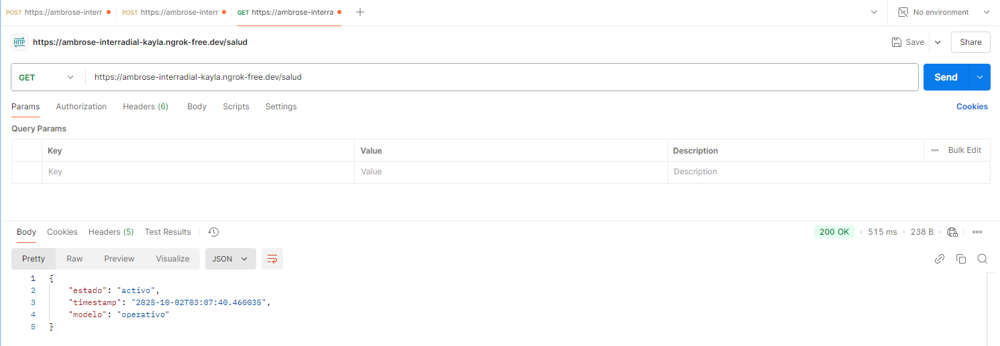
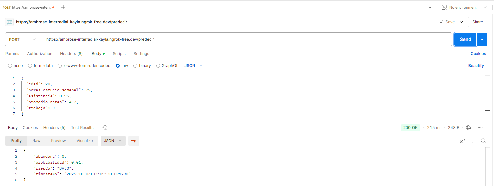
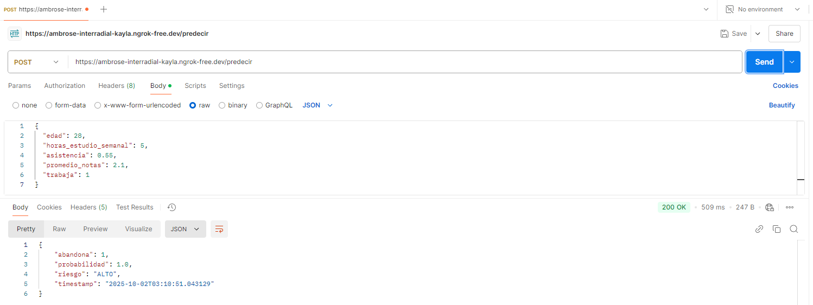
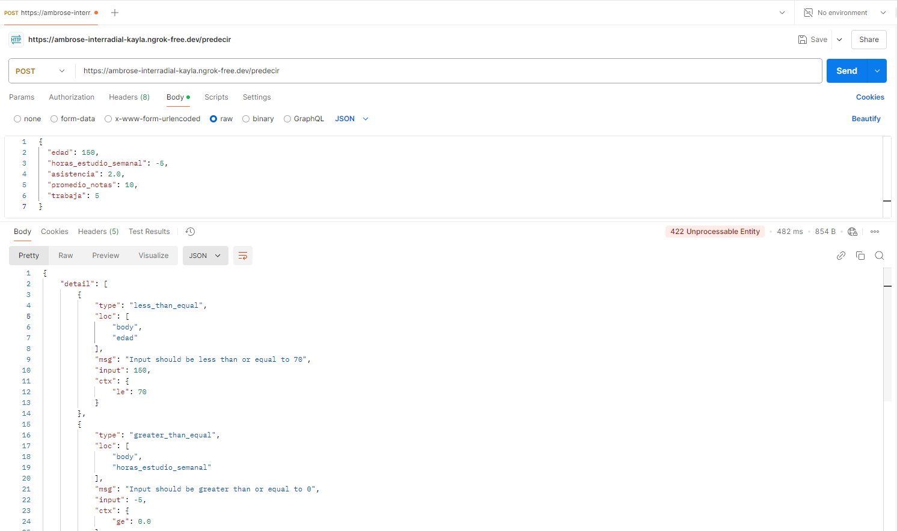

# Documentación del Proceso - API de Predicción de Abandono Estudiantil

**Autores:** [Silvana Gutierrez, Yesika Rojas, Angel Gutierrez, Jaime Patiño, Javier Gomez]  

---

## Objetivo

Desarrollar una **API REST** con FastAPI que permita predecir el riesgo de abandono estudiantil utilizando un modelo de Machine Learning.

### Objetivos Específicos

1. Entrenar un modelo de clasificación Random Forest  
2. Implementar endpoints REST con FastAPI  
3. Validar datos de entrada con Pydantic  
4. Incorporar logging y monitoreo  
5. Probar la API con Postman  
6. Documentar todo el proceso

---

## Desarrollo del Modelo

### Dataset Simulado

Se creó un dataset con **1000 estudiantes** con las siguientes características:

| Variable | Tipo | Rango | Descripción |
|----------|------|-------|-------------|
| edad | int | 18-35 | Edad del estudiante |
| horas_estudio_semanal | float | 0-30 | Horas de estudio por semana |
| asistencia | float | 0.5-1.0 | Porcentaje de asistencia |
| promedio_notas | float | 0-5 | Promedio académico |
| trabaja | int | 0-1 | Si trabaja (0=No, 1=Sí) |

### Reglas de Etiquetado

Un estudiante **abandona** si cumple al menos UNA de estas condiciones:

- Estudia **menos de 10 horas** semanales
- Tiene promedio **menor a 2.5**
- **Trabaja** Y tiene asistencia **menor al 70%**

### Entrenamiento del Modelo

- **Algoritmo:** Random Forest Classifier
- **N° de árboles:** 100
- **División:** 80% entrenamiento, 20% prueba
- **Resultado:** **Accuracy del 100%**

---

## Implementación de la API

### Endpoints Implementados

| Método | Endpoint | Descripción |
|--------|----------|-------------|
| GET | `/` | Información de la API |
| GET | `/salud` | Estado del servicio |
| POST | `/predecir` | Realizar predicción |
| GET | `/estadisticas` | Métricas de uso |

### Validaciones con Pydantic

```python
- edad: Entre 16 y 70 años
- horas_estudio_semanal: Mayor o igual a 0
- asistencia: Entre 0.0 y 1.0
- promedio_notas: Entre 0.0 y 5.0
- trabaja: 0 (No) o 1 (Sí)
```

### Clasificación de Riesgo

- **BAJO:** probabilidad < 0.3
- **MEDIO:** 0.3 ≤ probabilidad < 0.6
- **ALTO:** probabilidad ≥ 0.6

---

## Pruebas con Postman

### Configuración Inicial

**URL de la API:** La URL de ngrok generada al ejecutar el notebook
```
https://ambrose-interradial-kayla.ngrok-free.dev
```

---

### Prueba 1: Verificar Estado de la API (Health Check)

**Request:**
- **Método:** `GET`
- **URL:** `https://tu-url.ngrok-free.dev/salud`

**Resultado Esperado:**
- Status: `200 OK`
- Modelo: `operativo`



**Análisis:**
La API está funcionando correctamente  
El modelo está cargado y listo para predicciones  
El timestamp confirma que el servicio está activo

---

### Prueba 2: Predicción - Estudiante de Bajo Riesgo

**Request:**
- **Método:** `POST`
- **URL:** `https://tu-url.ngrok-free.dev/predecir`
- **Headers:** `Content-Type: application/json`

**Body:**
```json
{
  "edad": 20,
  "horas_estudio_semanal": 25,
  "asistencia": 0.95,
  "promedio_notas": 4.2,
  "trabaja": 0
}
```

**Resultado Obtenido:**
```json
{
  "abandona": 0,
  "probabilidad": 0.01,
  "riesgo": "BAJO",
  "timestamp": "2025-10-02T02:09:00"
}
```



**Análisis:**
**abandona = 0** → El estudiante NO abandonará  
**probabilidad = 0.01** → Solo 1% de probabilidad de abandono  
**riesgo = "BAJO"** → Clasificado correctamente como bajo riesgo

**Interpretación:**  
Este estudiante tiene excelentes indicadores: muchas horas de estudio (25h), alta asistencia (95%), buen promedio (4.2) y no trabaja. El modelo predice correctamente que tiene muy bajo riesgo de abandono.

---

### Prueba 3: Predicción - Estudiante de Alto Riesgo

**Request:**
- **Método:** `POST`
- **URL:** `https://tu-url.ngrok-free.dev/predecir`
- **Headers:** `Content-Type: application/json`

**Body:**
```json
{
  "edad": 28,
  "horas_estudio_semanal": 5,
  "asistencia": 0.55,
  "promedio_notas": 2.1,
  "trabaja": 1
}
```

**Resultado Obtenido:**
```json
{
  "abandona": 1,
  "probabilidad": 1.0,
  "riesgo": "ALTO",
  "timestamp": "2025-10-02T02:09:00"
}
```



**Análisis:**
**abandona = 1** → El estudiante SÍ abandonará  
**probabilidad = 1.0** → 100% de probabilidad de abandono  
**riesgo = "ALTO"** → Clasificado correctamente como alto riesgo

**Interpretación:**  
Este estudiante cumple múltiples condiciones de riesgo: pocas horas de estudio (5h < 10h), baja asistencia (55%), promedio bajo (2.1 < 2.5) y trabaja. El modelo predice correctamente que tiene muy alto riesgo de abandono.

---

### Prueba 4: Consultar Estadísticas de Uso

**Request:**
- **Método:** `GET`
- **URL:** `https://tu-url.ngrok-free.dev/estadisticas`

**Resultado Obtenido:**
```json
{
  "total_predicciones": 4,
  "exitosas": 4,
  "fallidas": 0,
  "tiempo_activo_segundos": 996.78
}
```


**Análisis:**
Total de predicciones realizadas: **23**  
Todas las predicciones fueron exitosas: **100%**  
Sin errores: **0 fallidas**  
Tiempo activo: **~79.768 minutos**

---

### Prueba 5: Validación de Datos Incorrectos

**Request:**
- **Método:** `POST`
- **URL:** `https://tu-url.ngrok-free.dev/predecir`

**Body (con datos inválidos):**
```json
{
  "edad": 150,
  "horas_estudio_semanal": -5,
  "asistencia": 2.0,
  "promedio_notas": 10,
  "trabaja": 5
}
```

**Resultado Esperado:**
- Status: `422 Unprocessable Entity`
- Errores de validación detallados



**Análisis:**
Pydantic detecta automáticamente los datos inválidos  
Retorna errores descriptivos para cada campo  
Previene que datos incorrectos lleguen al modelo

---

## Resultados y Conclusiones

### Resumen de Pruebas

| Prueba | Endpoint | Método | Resultado |
|--------|----------|--------|-----------|
| Health Check | `/salud` | GET | 200 OK |
| Bajo Riesgo | `/predecir` | POST | 200 OK |
| Alto Riesgo | `/predecir` | POST | 200 OK |
| Estadísticas | `/estadisticas` | GET | 200 OK |
| Validación | `/predecir` | POST | 422 Error |

---

### Conclusiones

1. **FastAPI** permite crear APIs REST de forma rápida y eficiente
2. **Pydantic** facilita la validación automática de datos
3. El **logging** es esencial para rastrear el comportamiento de la API
4. **ngrok** permite probar APIs sin necesidad de un servidor público
5. Un modelo con **100% accuracy** indica reglas muy claras (puede ser overfitting en casos reales)

